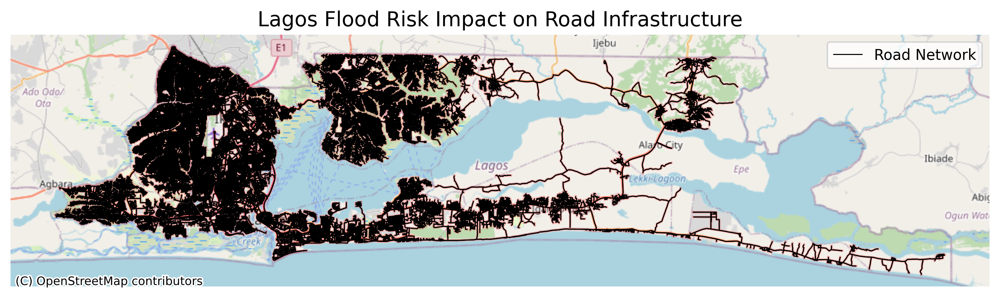

# lagos-flood-risk-analysis
GIS analysis of flood risk impact on road infrastructure in Lagos using OpenStreetMap and spatial modelling.

# Lagos Flood Risk & Road Accessibility Analysis

Infrastructure GIS case study evaluating flood exposure risk affecting road infrastructure in Lagos, Nigeria.

Developed by **InfraTech Consulting**.

---

# Project Overview

Urban flooding is a major infrastructure challenge in Lagos.
This project demonstrates how GIS spatial analysis can identify road infrastructure vulnerable to flooding.

The analysis integrates:

• OpenStreetMap road network extraction
• Flood risk buffer modelling
• Spatial overlay analysis
• Infrastructure risk visualization

---

# Study Area

Victoria Island, Lagos, Nigeria

A densely populated coastal area prone to seasonal flooding due to:

• coastal proximity
• heavy rainfall
• drainage limitations
• urban development density

---

# Methodology

The workflow consists of four GIS analysis steps.

### 1. Road Network Extraction

Road infrastructure is extracted from OpenStreetMap.

### 2. CRS Transformation

Data is projected to a metric coordinate system for accurate distance analysis.

### 3. Flood Risk Simulation

Flood exposure zones are simulated using spatial buffers.

### 4. Infrastructure Risk Overlay

Flood zones are intersected with the road network to identify exposed transport corridors.

---

# Example Output

The map highlights road segments located within simulated flood risk zones.

---

# Tools Used

Python
GeoPandas
Shapely
Matplotlib
Contextily
OpenStreetMap

---

# Applications

Flood risk assessment
Transportation resilience planning
Urban infrastructure management
Disaster preparedness analysis

---

# Author

InfraTech Consult,
Infrastructure Engineering & Geospatial Analysis

